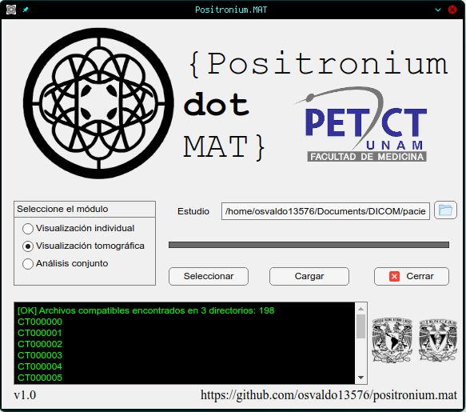
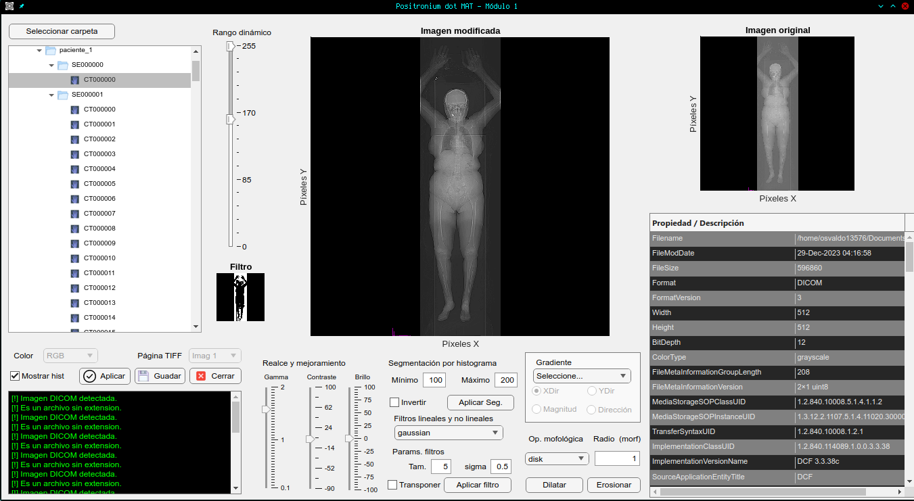
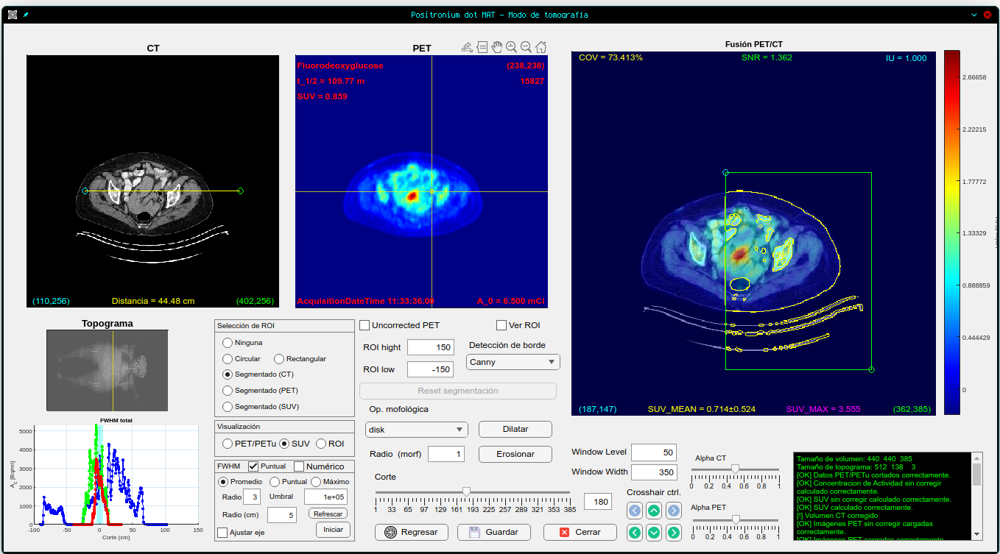
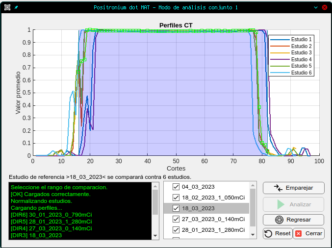
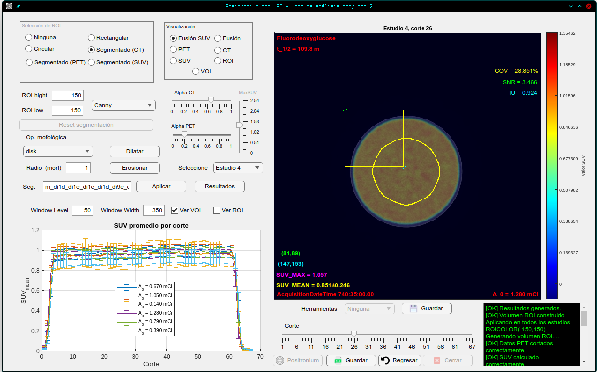

<p align="center">
	  
</p>

# Positronium.MAT
<div align="justify"> 
La aplicación escrita en el lenguaje de programación MATLAB, permite analizar imágenes DICOM de estudios PET/CT. La aplicación permite visualizar las imágenes, realizar la segmentación para crear regiones de interés, calcular el valor de captación estandarizado (SUV) promedio de las regiones de interés. Así mismo permite crear perfiles de intensidad de las imágenes usando los datos de concentración de actividad para cuantificar la resolución espacial de las imágenes. 

**Nota: El siguiente repositorio contiene el código fuente de la aplicación Positronium.MAT y las imágenes DICOM no están disponibles para su descarga, solo es para fines educativos.**
<br />

## Características
- [x] Lectura de imágenes DICOM.
- [x] Lectura individual y múltiple de estudios PET/CT.
- [x] Visualización de imágenes PET/CT.
- [x] Segmentación de imágenes.
- [x] Cálculo del valor de captación estandarizado (SUV).
- [x] Creación de perfiles de intensidad.
- [x] Análisis de resolución espacial.
- [x] Análisis de uniformidad y calidad de imagen.
- [x] Exportación de resultados a formato XLSX.
- [x] Exportación de imágenes a formato PNG.

## Requerimientos 

- [x] Tener instalado `git` en su sistema.
- [x] [MATLAB](https://la.mathworks.com/store/)  en su versión 2023b o recientes.
- [x] Sistemas operativos Windows(86x_64) y Linux.
- [x] Imágenes DICOM.


# Ejecución de la interfaz gráfica de usuario
## Descarga del repositorio
```sh
git clone https://github.com/osvaldo13576/positronium.mat
```
## Ejecución de la aplicación
Una vez descargado el repositorio, se debe abrir la aplicación en MATLAB, para ello se debe abrir el archivo `main0.m` y ejecutarlo. Una vez ejecutado, se desplegará la interfaz gráfica de usuario. Dentro de MATLAB ejecutar el siguiente comando
```sh
main0
```
### Ejecución de la aplicación desde la consola
Este método es útil para ejecutar la aplicación desde la consola de comandos de Windows o Linux. Para ello, se debe abrir la consola de comandos y ejecutar la siguiente línea para abrir la carpeta contenedora de la aplicación, por ejemplor si el directorio es `C:\Users\PC\Documents\GitHub\positronium.mat` se debe ejecutar:
```sh
cd C:\Users\PC\Documents\GitHub\positronium.mat
```
Ejecutar la aplicación desde la consola de comandos de Windows o Linux con la siguiente línea:
```sh
matlab -nosplash -nodesktop -r "main0"
```

## Interfaz gráfica de usuario: Positronium.MAT
### Módulo principal
<p align="center">
	  
</p>

### Lectura de imágenes 
<p align="center">
	
</p>

### Lectura de un estudio PET/CT
<p align="center">
	
</p>

### Lectura de múltiples estudios PET/CT
#### Módulo de de desplazamiento (shift) de estudios

<p align="center">
	
</p>

#### Módulo de lectura y análisis
<p align="center">
	
</p>
